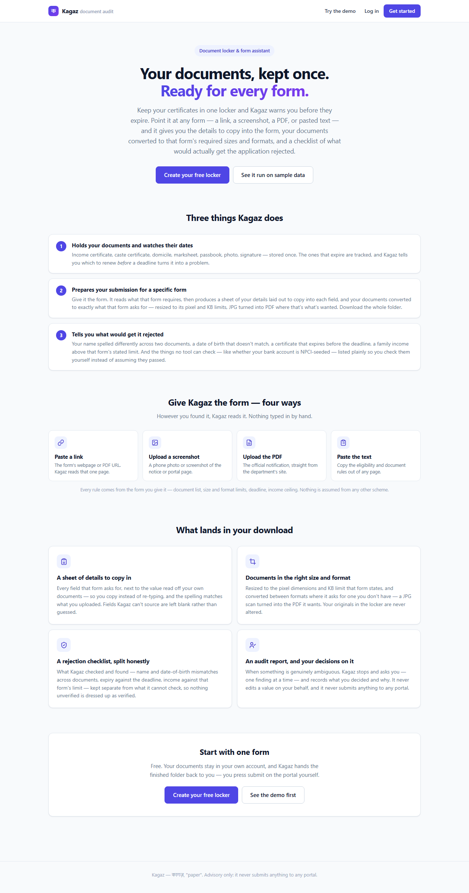
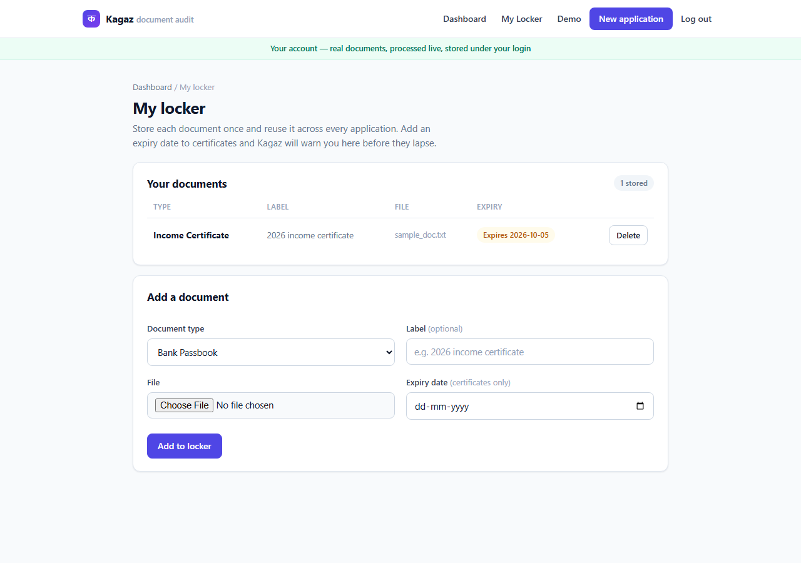
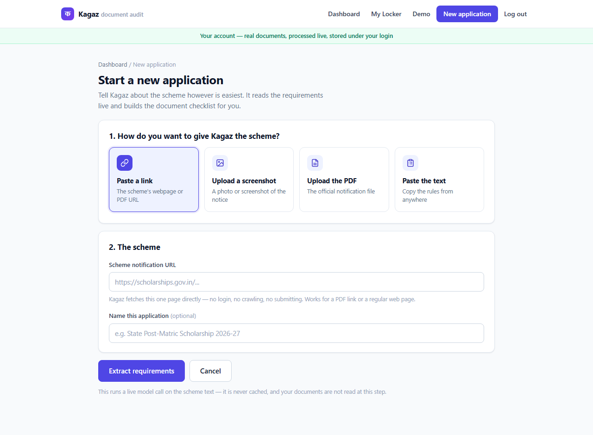
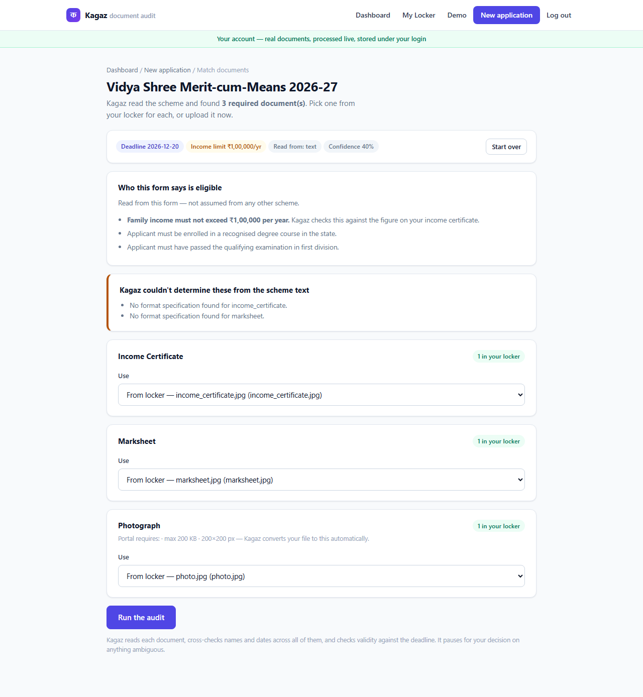
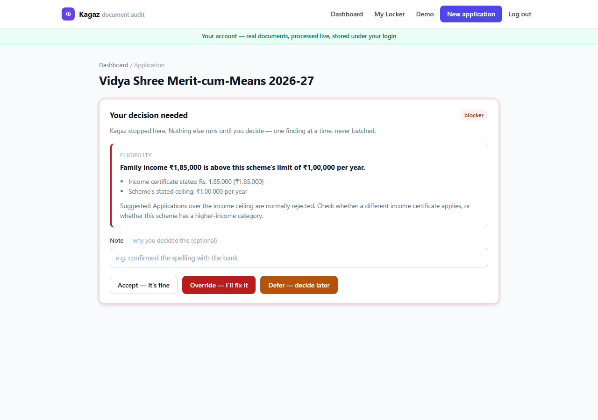
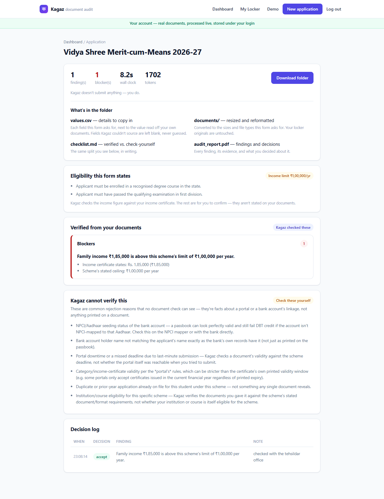

# Kagaz (कागज़ — "paper")

**A document locker and form assistant for Indian scheme paperwork.** Keep
your certificates in one place, get told when they're about to expire,
and — for any form you point it at — get the details to copy in, your
documents converted to that form's required sizes and formats, and a
checklist of what would actually get the application rejected.

**▶ Live: https://kagaz-529885327265.us-central1.run.app**
([try the demo](https://kagaz-529885327265.us-central1.run.app/demo) — no
signup needed, or create a locker to run it on your own documents).
Running on Google Cloud Run with Vertex AI, Firestore, and Cloud Storage.

Built for **[Hack Devengers 2.0](https://unstop.com/hackathons/hack-devengers-20-devengers-1749441)**
— a 24-hour, fully virtual Open Innovation hackathon on Unstop (19–20
September 2026), sponsored by Lovable, individual participation, no fixed
problem statement or tech stack. Built on the Strands Agents SDK;
originally started on AWS Bedrock, since migrated to Google Cloud Vertex
AI — see [`docs/vertex-setup.md`](docs/vertex-setup.md).

## What it does

**1. Holds your documents and watches their dates.** Income certificate,
caste certificate, domicile, marksheet, passbook, photo, signature —
stored once, reused for every form. The ones that expire are tracked, and
Kagaz tells you which to renew *before* a deadline turns it into a
problem, because a reissue takes weeks.

**2. Prepares your submission for a specific form.** Give it the form —
a link, a screenshot, the PDF, or pasted text. It reads what *that* form
requires and produces a sheet of your details laid out to copy into each
field, plus your documents converted to exactly what it asks for: resized
to its pixel and KB limits, JPG turned into PDF where that's what's
wanted. Download the whole folder.

**3. Tells you what would get it rejected.** Your name spelled
differently across two documents, a date of birth that doesn't match, a
certificate that expires before the deadline, a family income above that
form's stated ceiling. And — kept deliberately separate — the things no
tool can check, like whether your bank account is NPCI-seeded, listed
plainly so you check them yourself instead of assuming they passed.

Every rule comes from the form you give it: document list, size and format
limits, deadline, income ceiling. Nothing is hardcoded to one scheme, and
no figure is carried over from another.

## Who it's for

Students and applicants filing their own scheme applications, and the
office staff at schools, colleges, and coaching centres who process them
in bulk and don't have time to re-derive each form's rules by hand.

## See it work

|  |  |
| --- | --- |
|  |  |
| The product, in three tasks | **The locker** — documents stored once, expiry tracked, renewal prompted |
|  |  |
| **Four ways to give it a form** — link, screenshot, PDF, pasted text | **What that form requires**, read live, including the income ceiling |
|  |  |
| **A real pause for a human** — here, family income over the form's limit | **Findings split honestly** into verified vs. check-yourself |

## Quickstart

Requires Python 3.12 specifically — see the [toolchain note](#toolchain-note)
if your default `python` is something else.

```bash
git clone <this repo>
cd kagaz

python3.12 -m venv .venv
source .venv/bin/activate        # Windows: .venv\Scripts\activate

pip install --upgrade pip
pip install -r requirements.txt

pytest                            # 248 tests, replay mode, zero network/credentials
                                   # (+6 more that need real GCP credentials — see below)

uvicorn api.main:app --reload
```

Open http://127.0.0.1:8000. That's the product landing page; the synthetic
demo is at `/demo` — pick a student and a scheme and run the audit. For a
student with a flagged finding, the escalation screen will pause the run
until you accept, override, or defer it.

Every fixture (synthetic students, scheme PDFs, recorded model responses)
is checked into the repo, so `pytest` and the web UI both work immediately
after a clean clone — no API key, no Ollama install, no network required.

## Two flows, clearly separated

- **`/demo` — the synthetic demo.** Three fictional students, two real
  scheme PDFs, replay-mode by default. This is what the Quickstart above
  runs — no credentials needed.
- **`/signup`, `/login`, `/app` — real accounts.** Your own **digital
  locker**: upload each document once (JPG/PNG/PDF, with an expiry date if
  it has one) and reuse it across applications. Start an application by
  **dropping in anything** — screenshots, photos, PDFs, pasted text, a link,
  or any mix of them in one go, plus an optional note on what to pay
  attention to. Kagaz then
  matches your locker documents to what the scheme requires, runs the
  audit live (never cached, never replayed), pauses on anything ambiguous,
  and hands back a submission-ready folder. Runs and documents persist in
  Firestore/Cloud Storage under your login. Needs Google Cloud credentials
  (`docs/vertex-setup.md` §8). Every page here carries a green "your
  account" strip, distinct from the demo's amber one, so the two are never
  confused.

## The deterministic-core argument

Kagaz uses an LLM for exactly two things: reading a form's prose to figure
out what it requires, and reading document text to extract fields.
Everything downstream of that — comparing two names, comparing two dates
of birth, checking a validity window against a deadline, comparing a
family income against a form's ceiling, resizing a photo to spec,
packaging the output folder — is tested, deterministic Python with zero
LLM calls (`tools/name_match.py`, `tools/dates.py`, `tools/money.py`,
`agents/cross_checker.py`, `tools/formatting.py`, `tools/packager.py`). An LLM asked "are these the
same person" twice in a row can answer differently; that inconsistency is
fine in a chat window and fatal in a system that has to be right the same
way every time. The rule table behind this — when a name difference is
`likely_fine` versus a `blocker`, and why — is in
[`docs/blog-1-deterministic-core.md`](docs/blog-1-deterministic-core.md).

## Safety boundaries

- **The demo flow (`/demo`) is entirely synthetic.** Three fictional
  students, generated documents, generated scheme notifications. No real
  Aadhaar numbers, no real bank details, no real people. An amber
  "synthetic demo data" strip is on every screen of that flow and every
  generated PDF.
- **The real-account flow (`/app`) handles real user documents**, clearly
  separated behind its own login and its own green "your account" strip —
  never mixed into the demo's synthetic fixtures, never cached or
  replayed (forced `live` model calls, so nothing real is written to the
  committed replay cache).
- **Kagaz never submits anything to any portal, in either flow.** No
  login automation, no form filling on your behalf, no outbound requests
  to government sites beyond one thing: when you paste a form's URL it
  does a *single* GET of that one page to read it — SSRF-guarded
  (http/https only, private/loopback/link-local/metadata addresses
  refused, no redirects followed, size-capped), never a login, never a
  crawl. Its output is a downloadable folder; you press submit yourself.
- **Nothing is auto-corrected.** Findings are advice with evidence
  attached, in three severity tiers (`likely_fine`, `worth_knowing`,
  `blocker`). Only a `blocker` triggers escalation — a genuine, real
  Strands interrupt that pauses the run for a human decision, one finding
  at a time, never batched. See
  [`docs/blog-3-escalation.md`](docs/blog-3-escalation.md).

## Architecture


Purple = an LLM call. Green = deterministic Python. Red = the one place a
human is genuinely in the loop. Full walkthrough in
[`docs/architecture.md`](docs/architecture.md).

## Cost discipline

No agent talks to a model provider directly — every agent gets its model
from one factory function (`model_provider.py`), selected by
`KAGAZ_MODEL_PROVIDER`:

- `vertex` (default) — Google Cloud Vertex AI (Gemini), via Application
  Default Credentials — no API keys in code, no service account JSON
  committed. Setup: [`docs/vertex-setup.md`](docs/vertex-setup.md).
- `ollama` — local, free, the offline dev fallback. Works with no cloud
  credentials at all.
- `bedrock` — this project's original provider during early development;
  raises `NotImplementedError` now that it's moved to Vertex AI.
- `anthropic` — not wired up yet.

Every model call is routed through a record/replay cache (`llm_cache.py`,
entries in `fixtures/llm_cache/`), keyed on `(provider, model, prompt,
inputs)` and controlled by `KAGAZ_LLM_MODE`:

- `replay` (default, and what `pytest`/CI uses) — served entirely from
  recorded fixtures. A cache miss raises `LLMCacheMiss` naming the exact
  missing key, rather than touching the network.
- `record` — calls the real model and refreshes the cached entry.
- `live` — calls the real model and never touches the cache.

The requirement extractor's single "read this whole scheme PDF" task is
decomposed into four small, independently-cached calls (checklist,
fields, format specs, deadline) rather than one large schema — an 8B local
model handles four small tasks reliably where it fails one big one. The
real-world example, including the failure it caught: `Photograph` and
`Specimen Signature` were mentioned only in prose, and the checklist call
missed both on the first pass, while the *format-specs* call correctly
found their table entries in the page-3 annexure — caught because the two
calls are independently checkable, not blended into one. Full writeup in
[`docs/blog-2-cost-discipline.md`](docs/blog-2-cost-discipline.md).

`pytest` passes with zero network access and no credentials configured —
verify it yourself with `KAGAZ_OLLAMA_HOST=http://127.0.0.1:1 pytest`.

### Toolchain note

This project uses a plain `venv` + `pip install -r requirements.txt`, not
`uv` — `uv` currently ships no wheels for Python 3.14, which is many
systems' default `python`. Pin directly to a Python 3.12 interpreter and
this is a non-issue.

### Ollama (optional — only needed to re-record fixtures)

Every fixture needed to run `pytest` or the web UI is already committed,
so Ollama is **not required** to try Kagaz. It's only needed if you want
to regenerate a fixture (`KAGAZ_LLM_MODE=record`) against a real local
model:

```bash
winget install Ollama.Ollama   # or https://ollama.com/download
ollama pull llama3.1:8b
```

## Deploying

The `Dockerfile` here is what the live deployment runs on **Google Cloud
Run**, in the same project as Vertex AI / Firestore / Cloud Storage, so
credentials come from the runtime service account via Application Default
Credentials — no key file is ever built into the image:

```bash
gcloud run deploy kagaz --source . \
  --project <your-project> --region us-central1 \
  --allow-unauthenticated --memory 2Gi --cpu 2 \
  --max-instances 1 --no-cpu-throttling \
  --set-env-vars "KAGAZ_MODEL_PROVIDER=vertex,KAGAZ_LLM_MODE=replay,\
KAGAZ_OCR_BACKEND=vision,KAGAZ_ENV=production,\
GOOGLE_CLOUD_PROJECT=<your-project>,GOOGLE_CLOUD_LOCATION=us-central1,\
KAGAZ_GCS_BUCKET=<your-bucket>,KAGAZ_SESSION_SECRET=<random-secret>"
```

The runtime service account needs `roles/aiplatform.user`,
`roles/datastore.user`, and `roles/storage.objectAdmin`. Setup for the
Firestore database, the GCS bucket, and the composite indexes is in
[`docs/vertex-setup.md`](docs/vertex-setup.md) §8.

Two deployment flags are load-bearing rather than cosmetic:
`--max-instances 1` because live run state (the escalation pause) is held
in memory in one process, and `--no-cpu-throttling` so the background
audit thread keeps running between the status page's polls.

`KAGAZ_LLM_MODE=replay` is correct even in production: it makes the
synthetic demo serve from committed fixtures (instant and free), while
the real-account flow forces `live` in code regardless, so real documents
are never served from — or written to — the replay cache.

`render.yaml` remains for a one-click Render Blueprint deploy of the demo
flow only; Render has no access to this project's Vertex/Firestore
credentials, so the real-account flow needs the Cloud Run path above.

## What's built

**Demo flow (complete):** contracts, LLM record/replay cache, synthetic
fixtures (3 students, 2 schemes), cross-checker, formatter, requirement
extractor, OCR, five document verifiers, the coordinator (Workflow
multi-agent pattern — see `docs/sdk-notes.md` for why, over Graph/Swarm),
the escalation interrupt, the expiry watcher, the packager, and a FastAPI
web UI. Provider migrated from AWS Bedrock to Google Cloud Vertex AI — see
[`docs/vertex-setup.md`](docs/vertex-setup.md).

**Real-account flow (built on top of the same deterministic core above):**
- [x] Accounts — email/password signup, login, session, Firestore-backed
  (`auth.py`, `db.py`, `api/auth_routes.py`).
- [x] Persistence — Firestore for user/run/document records, Cloud Storage
  for uploaded files and generated packages (`db.py`, `blob_storage.py`).
- [x] Digital locker — upload once, reuse across applications, with expiry
  dates surfaced as an "expiring soon" view (`/app/documents`).
- [x] Multi-source scheme input (`agents/scheme_input.py`) — paste text,
  upload a PDF or screenshot, or paste a URL (SSRF-guarded single GET,
  no redirects, no crawl) — all feeding the same requirement extractor.
- [x] Real document runs — the coordinator takes an explicit
  `documents: dict[str, Path]` (`run_audit_for_documents`), forced to
  `live` model mode so real documents are never written to the replay
  cache. PDFs are read via their text layer, images via OCR/vision.
- [x] Eligibility checking (`tools/money.py`, `cross_checker.income_findings`)
  — the form's own income ceiling is extracted from its text, parsed from
  any of `Rs. 2,50,000` / `₹2.5 lakh` / `1 crore`, and compared against
  the figure read off the income certificate. Over the limit is a blocker;
  unreadable is flagged rather than silently passed; a form that states no
  ceiling produces no finding and no invented figure.
- [x] The verified / can't-verify checklist split: what Kagaz actually
  checked from your documents, versus a curated list of common
  non-document rejection causes (NPCI/bank seeding, portal downtime,
  institution eligibility) it explicitly flags as outside what documents
  alone can confirm.
- [x] Renewal prompts — the locker says what to *do* about an expiring
  document ("start the renewal now; these usually take a few weeks to
  issue"), not just when it lapses.

### Known limitations

- Live run state (the escalation pause, the generated folder) is held in
  memory in one process, so the deployment pins `--max-instances 1` and a
  run's progress is lost if the instance restarts. The Firestore record of
  the run survives; the downloadable folder does not.
- The form-filling sheet can only fill fields that appear on a document
  you actually uploaded. It reads name, father's name, DOB, address,
  account number, IFSC, bank, category, marks, institution, certificate
  and Aadhaar numbers — but if you never upload an Aadhaar card, that row
  stays blank rather than being guessed.
- Eligibility rules other than the income ceiling are extracted and shown
  to you, but not verified against documents; they're listed for you to
  confirm.

## License

MIT — see [LICENSE](LICENSE).
