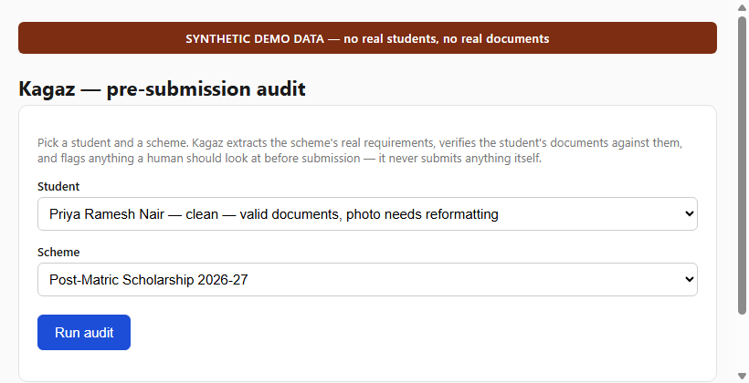
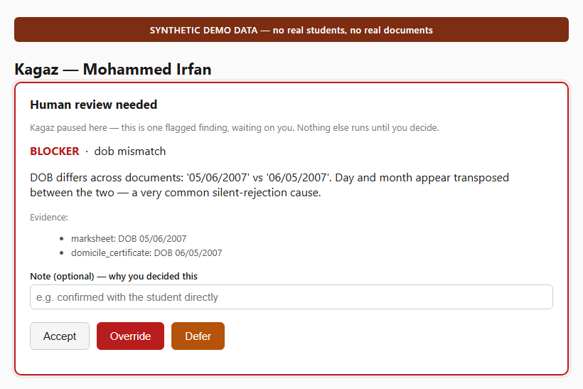
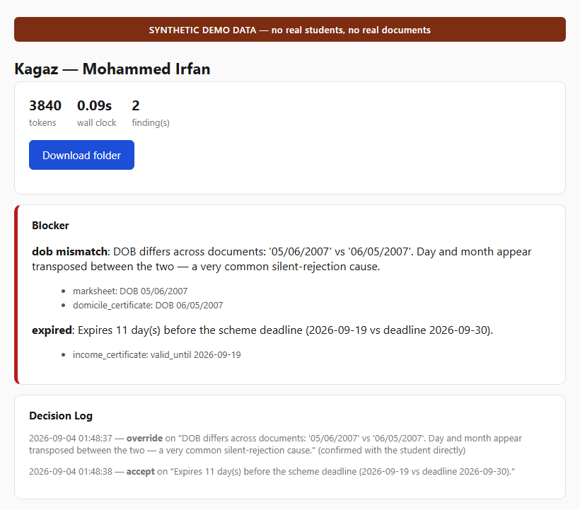
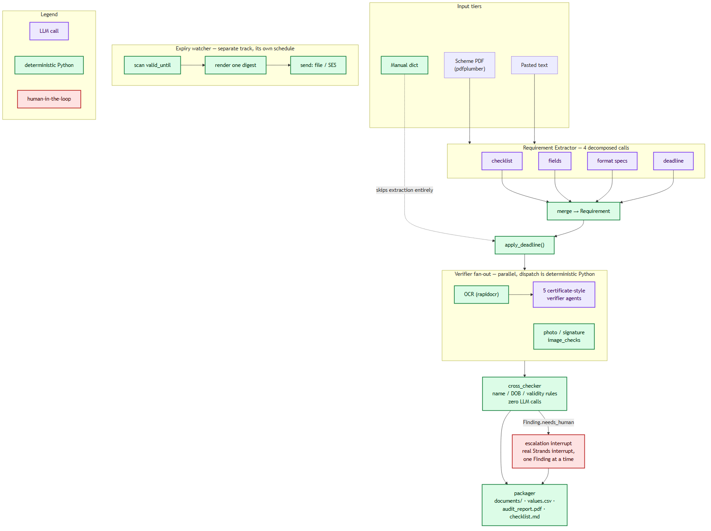

# Kagaz (कागज़ — "paper")

**A pre-submission audit agent for Indian student scheme paperwork.** Give
it a scheme notification and a student's documents; it tells you exactly
what will get the application rejected — before a portal does.

Built for **[Hack Devengers 2.0](https://unstop.com/hackathons/hack-devengers-20-devengers-1749441)**
— a 24-hour, fully virtual Open Innovation hackathon on Unstop (19–20
September 2026), sponsored by Lovable, individual participation, no fixed
problem statement or tech stack. Built on the Strands Agents SDK;
originally started on AWS Bedrock, since migrated to Google Cloud Vertex
AI — see [`docs/vertex-setup.md`](docs/vertex-setup.md).

## The problem, in three sentences

A school or coaching centre's office handles scheme applications for
hundreds of students, and most rejections aren't about merit — a certificate
that expired eleven days before the deadline, a photo two kilobytes over
the portal's cap, a date of birth entered as `05/06/2007` on one document
and `06/05/2007` on another. Nobody catches these on a skim: they look
fine, they aren't, and the office finds out only when the rejection
letter arrives and the window has already closed. Kagaz reads the scheme
notification itself, checks a student's documents against what it
actually requires, and surfaces exactly this class of silent, technicality
rejection before submission — while never submitting anything itself.

## Who it's for

Office staff at a school, college, or coaching centre who process scheme
applications in bulk and don't have time to re-derive each scheme's format
rules by hand for every student.

## See it work

<table>
<tr><td width="33%"></td>
<td width="33%"></td>
<td width="33%"></td></tr>
<tr><td>Pick a student and scheme</td><td><b>The escalation screen</b> — Kagaz genuinely pauses here, waiting on a human</td><td>Findings by severity, decision log, token count and wall-clock time</td></tr>
</table>

## Quickstart

Requires Python 3.12 specifically — see the [toolchain note](#toolchain-note)
if your default `python` is something else.

```bash
git clone <this repo>
cd kagaz

python3.12 -m venv .venv
source .venv/bin/activate        # Windows: .venv\Scripts\activate

pip install --upgrade pip
pip install -r requirements.txt

pytest                            # 185 tests, replay mode, zero network/credentials
                                   # (+6 more that need real GCP credentials — see below)

uvicorn api.main:app --reload
```

Open http://127.0.0.1:8000, pick a student and scheme, and run the audit.
For a student with a flagged finding, the escalation screen will pause the
run until you accept, override, or defer it.

Every fixture (synthetic students, scheme PDFs, recorded model responses)
is checked into the repo, so `pytest` and the web UI both work immediately
after a clean clone — no API key, no Ollama install, no network required.

## Two flows, clearly separated

- **`/` — the synthetic demo.** Three fictional students, two real scheme
  PDFs, replay-mode by default. This is what the Quickstart above runs —
  no credentials needed.
- **`/signup`, `/login`, `/app` — real accounts.** Create an account,
  Kagaz processes real documents live (never cached, never replayed) and
  stores your runs under your login in Firestore/Cloud Storage. Needs
  Google Cloud credentials configured (`docs/vertex-setup.md` §8) — every
  page in this flow carries its own "YOUR ACCOUNT" banner, distinct from
  the demo's "SYNTHETIC DEMO DATA" one, so the two are never confused.
  Uploading your own scheme documents and running a full audit through
  this flow is still in progress — signup/login/dashboard work today;
  scheme-input (paste/PDF/screenshot/URL) and document upload are next.

## The deterministic-core argument

Kagaz uses an LLM for exactly two things: reading a scheme notification's
prose to figure out what it requires, and reading OCR'd document text to
extract fields. Everything downstream of that — comparing two names,
comparing two dates of birth, checking a validity window against a
deadline, resizing a photo to spec, packaging the output folder — is
tested, deterministic Python with zero LLM calls
(`tools/name_match.py`, `tools/dates.py`, `agents/cross_checker.py`,
`tools/formatting.py`, `tools/packager.py`). An LLM asked "are these the
same person" twice in a row can answer differently; that inconsistency is
fine in a chat window and fatal in a system that has to be right the same
way every time. The rule table behind this — when a name difference is
`likely_fine` versus a `blocker`, and why — is in
[`docs/blog-1-deterministic-core.md`](docs/blog-1-deterministic-core.md).

## Safety boundaries

- **The demo flow (`/`) is entirely synthetic.** Three fictional students,
  generated documents, generated scheme notifications. No real Aadhaar
  numbers, no real bank details, no real people. A `SYNTHETIC DEMO DATA`
  banner is on every screen of that flow and every generated PDF.
- **The real-account flow (`/app`) handles real user documents**, clearly
  separated behind its own login and its own "YOUR ACCOUNT" banner — never
  mixed into the demo's synthetic fixtures, never cached/replayed (forced
  `live` model calls, see `docs/vertex-setup.md`).
- **Kagaz never submits anything to any portal, in either flow.** No
  login automation, no outbound requests to government sites. Its output
  is a downloadable folder; a human takes it from there and presses
  submit. The one planned exception (not yet built — see "What's built")
  is reading a *single* scheme URL a real user pastes in — a plain GET
  with SSRF guards, never a login, never a crawl.
- **Nothing is auto-corrected.** Findings are advice with evidence
  attached, in three severity tiers (`likely_fine`, `worth_knowing`,
  `blocker`). Only a `blocker` triggers escalation — a genuine, real
  Strands interrupt that pauses the run for a human decision, one finding
  at a time, never batched. See
  [`docs/blog-3-escalation.md`](docs/blog-3-escalation.md).

## Architecture



Purple = an LLM call. Green = deterministic Python. Red = the one place a
human is genuinely in the loop. Full walkthrough in
[`docs/architecture.md`](docs/architecture.md).

## Cost discipline

No agent talks to a model provider directly — every agent gets its model
from one factory function (`model_provider.py`), selected by
`KAGAZ_MODEL_PROVIDER`:

- `vertex` (default) — Google Cloud Vertex AI (Gemini), via Application
  Default Credentials — no API keys in code, no service account JSON
  committed. Setup: [`docs/vertex-setup.md`](docs/vertex-setup.md).
- `ollama` — local, free, the offline dev fallback. Works with no cloud
  credentials at all.
- `bedrock` — this project's original provider during early development;
  raises `NotImplementedError` now that it's moved to Vertex AI.
- `anthropic` — not wired up yet.

Every model call is routed through a record/replay cache (`llm_cache.py`,
entries in `fixtures/llm_cache/`), keyed on `(provider, model, prompt,
inputs)` and controlled by `KAGAZ_LLM_MODE`:

- `replay` (default, and what `pytest`/CI uses) — served entirely from
  recorded fixtures. A cache miss raises `LLMCacheMiss` naming the exact
  missing key, rather than touching the network.
- `record` — calls the real model and refreshes the cached entry.
- `live` — calls the real model and never touches the cache.

The requirement extractor's single "read this whole scheme PDF" task is
decomposed into four small, independently-cached calls (checklist,
fields, format specs, deadline) rather than one large schema — an 8B local
model handles four small tasks reliably where it fails one big one. The
real-world example, including the failure it caught: `Photograph` and
`Specimen Signature` were mentioned only in prose, and the checklist call
missed both on the first pass, while the *format-specs* call correctly
found their table entries in the page-3 annexure — caught because the two
calls are independently checkable, not blended into one. Full writeup in
[`docs/blog-2-cost-discipline.md`](docs/blog-2-cost-discipline.md).

`pytest` passes with zero network access and no credentials configured —
verify it yourself with `KAGAZ_OLLAMA_HOST=http://127.0.0.1:1 pytest`.

### Toolchain note

This project uses a plain `venv` + `pip install -r requirements.txt`, not
`uv` — `uv` currently ships no wheels for Python 3.14, which is many
systems' default `python`. Pin directly to a Python 3.12 interpreter and
this is a non-issue.

### Ollama (optional — only needed to re-record fixtures)

Every fixture needed to run `pytest` or the web UI is already committed,
so Ollama is **not required** to try Kagaz. It's only needed if you want
to regenerate a fixture (`KAGAZ_LLM_MODE=record`) against a real local
model:

```bash
winget install Ollama.Ollama   # or https://ollama.com/download
ollama pull llama3.1:8b
```

## Deploying

`render.yaml` is ready for a one-click Render Blueprint deploy (`KAGAZ_LLM_MODE=replay`,
so the deployed instance runs entirely off committed fixtures — instant,
free, and the web UI says so on every page). Deploying it is a manual step
outside this repo (push to a GitHub remote you control, then connect that
repo in Render's dashboard) rather than something run from here.

## What's built

**Demo flow (complete):** contracts, LLM record/replay cache, synthetic
fixtures (3 students, 2 schemes), cross-checker, formatter, requirement
extractor, OCR, five document verifiers, the coordinator (Workflow
multi-agent pattern — see `docs/sdk-notes.md` for why, over Graph/Swarm),
the escalation interrupt, the expiry watcher, the packager, and a FastAPI
web UI. Provider migrated from AWS Bedrock to Google Cloud Vertex AI — see
[`docs/vertex-setup.md`](docs/vertex-setup.md).

**Real-account flow (in progress, built on top of the same deterministic
core above):**
- [x] Accounts — email/password signup, login, session, Firestore-backed
  (`auth.py`, `db.py`, `api/auth_routes.py`).
- [x] Persistence infra — Firestore for user/run records, Cloud Storage for
  uploaded documents and generated packages (`db.py`, `blob_storage.py`).
- [ ] Multi-source scheme input — paste text, upload a scheme PDF or
  screenshot, or paste a scheme URL (SSRF-guarded single GET) — all
  feeding the same requirement extractor the demo flow uses.
- [ ] Real document upload + a generalized coordinator that runs against
  uploaded files instead of the demo's pre-seeded fixtures, always in
  `live` model mode (never cached).
- [ ] The verified / can't-verify checklist split: findings Kagaz actually
  checked from your documents, versus a static list of common non-document
  rejection causes (e.g. NPCI/bank-seeding status) that it explicitly
  flags as outside what documents alone can confirm.

## License

MIT — see [LICENSE](LICENSE).
