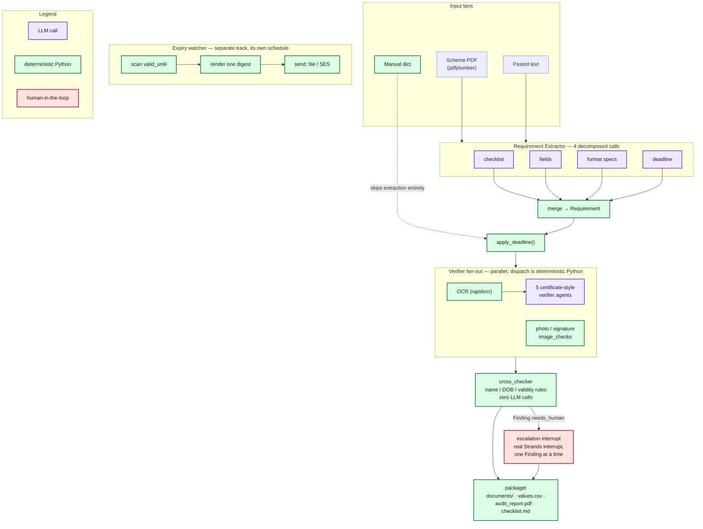

# Architecture

Kagaz's central argument is visible in this one diagram: **most of the
pipeline is deterministic Python, not an LLM**. Purple boxes are the only
places a model is actually called. Everything green is pure, tested
Python — name/DOB comparison, validity-window math, OCR, image checks,
packaging, the expiry watcher. The one red box is the escalation
interrupt: a genuine pause for a human decision, never approximated with a
status flag.

(Source: [`architecture.mmd`](architecture.mmd) — regenerate the PNG with
`npx @mermaid-js/mermaid-cli -i docs/architecture.mmd -o docs/architecture.png -b white -w 1600`.)

## Reading the diagram

- **Input tiers** (top): a scheme notification arrives as a PDF (primary),
  pasted text (secondary), or — skipping extraction entirely — a manual
  dict a human already filled in. No URL fetching, no scraping.
- **Requirement Extractor**: four small, independently-cached model calls
  (checklist / fields / format specs / deadline) instead of one big
  schema — an 8B local model handles one small task reliably where it
  fails a large one (see `docs/blog-2-cost-discipline.md`). Merged
  deterministically in Python; nothing here is guessed — unresolved items
  land in `Requirement.unresolved`.
- **`apply_deadline()`**: copies the scheme deadline onto every
  `RequiredDoc` that actually expires (certificates, not marksheets or
  passbooks). This exists because the extractor deliberately never
  invents a per-document validity policy — see `agents/coordinator.py`'s
  docstring for the bug that fix guards against.
- **Verifier fan-out**: OCR is deterministic (rapidocr); reading fields off
  that OCR text is genuinely an LLM's job (five small agents, one per
  document type), but *which* verifier runs for *which* document is
  decided by Python, not a model — this is the Workflow multi-agent
  pattern (see `docs/sdk-notes.md`), not Graph or Swarm. Photo/signature
  never touch an LLM at all.
- **`cross_checker`**: the differentiating component, and it makes zero
  LLM calls. Name comparison, DOB comparison, and validity-window math are
  tested Python functions with a fixed rule table — an LLM asked "are
  these the same person" is inconsistent across runs, which is fatal in a
  live demo (see `docs/blog-1-deterministic-core.md`).
- **Escalation interrupt**: the one red box, and the only place a real
  pause happens. When a `Finding.needs_human` is `True`, the coordinator
  raises a genuine Strands interrupt — one Finding at a time, never
  batched — and waits for a human's accept/override/defer before
  continuing (see `docs/blog-3-escalation.md`).
- **Packager**: builds the deliverable folder and stops. Kagaz never
  submits anything to any portal; a human takes the folder from here.
- **Expiry watcher**: a separate track entirely — it doesn't run as part
  of an audit, it runs on its own schedule, scanning every stored
  document's `valid_until` and emailing one digest when something crosses
  a 60/30/7-day-out or expiry-day threshold.
